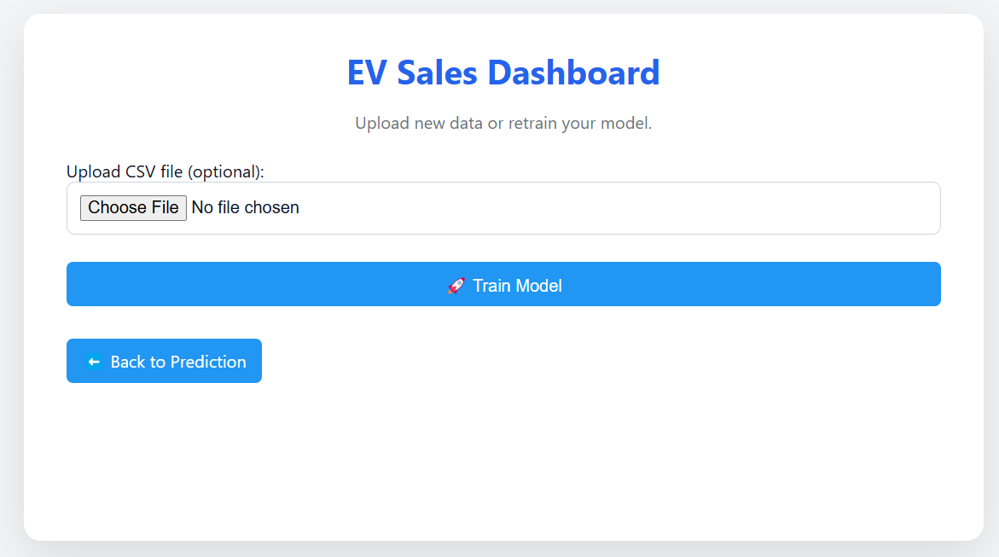
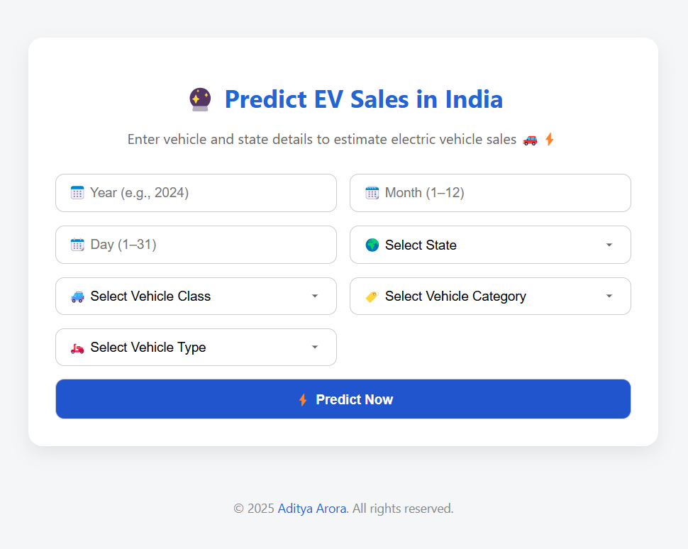

# ⚡ Electric Vehicle Sales Predictor – India


---

## 🚘 Overview

A **machine learning-powered web app** that predicts **electric vehicle (EV) sales** in **Indian states** based on user input features.

This dynamic **web application** predicts electric vehicle (EV) sales trends using a **custom-trained machine learning model**. Users can **upload new datasets**, **train or retrain models** directly from the dashboard, and explore **powerful insights** through **interactive visualizations** and **downloadable reports**. Built for **analysts, policy makers, and auto manufacturers** to decode the future of EV markets—state by state, type by type, and over time.

## 📷 UI Preview

1. Dashboard :



2. Prediction Page :



## 🎯 Prediction Output Screenshot

Here’s a sample output :


---

## 🔑 Features

### 🎯 Add-Ons Like Never Before

1. Dynamic Dropdowns auto-filled from dataset (vehicle types, classes, brands, etc.)
2. Light/Dark Mode switch for better accessibility and modern feel
3. Real-time graph updates post prediction or training
4. Upload your own CSV to retrain the model from the dashboard

### 🔍 EV Sales Prediction

- Inputs:
   - Vehicle Type
   - Brand/Model
   - State
   - Year

- Uses a trained model to predict EV sales volume

### 📈 Dynamic Visualizations

Graphs include:
- EV Sales by State
- EV Sales Trends over Years
- Vehicle Type Distribution
- Brand-wise Sales Share (Future)
- Correlation Matrix (Future)
- Custom graphs rendered from user selection (Future)

### 🛠️ Model Management

- Train new models using uploaded .csv via the dashboard
- Upload new training data directly
- Train model on-the-fly with one click
- Models saved as .pkl files for future predictions

### 📄 PDF Report

- Downloadable report with:
  - Prediction result
  - Embedded analysis graphs
  - Copyright

---

## 🧠 Tech Stack

| Layer        | Tech                                      |
|--------------|-------------------------------------------|
| Backend      | Python, Flask                             |
| ML/Processing| scikit-learn, pandas, NumPy               |
| Text Features| TF-IDF Vectorization                      |
| Visualization| matplotlib, seaborn                       |                     
| Frontend     | HTML, CSS, JavaScript (custom styles)     |

---

## 🗂️ Project Structure

```
ELECTRIC_VEHICLE_SALES/
│
├── app.py
├── train_model.py
├── extract_dropdown_data.py
├── graphs.py
├── requirements.txt
│
├── data/
│   └── EV_sales_india.csv
│
├── model/
│   ├── model.pkl
│   ├── features.pkl
│   └── dropdown_data.pkl
│
├── static/
│   ├── styles.css
│   ├── graphs.css
│   └── graphs/
│       └── *.png
│
├── templates/
│   ├── index.html
│   ├── result.html
│   └── dashboard.html
│
└── README.md
```

---

## 🚀 How to Run the App

1. Install dependencies:
   ```bash
   pip install -r requirements.txt
   ```

2. Create these folders and files:
   ```bash
   create model folder
   create model.pkl , features.pkl & dropdown_data.pkl
   keep all .pkl files empty
   (req to save trained models)
   ```

3. Train the model (Optional):
   ```bash
   python train_model.py
   ```

4. Run the Flask app:
   ```bash
   python app.py
   ```

5. Open browser at:
   ```
   http://localhost:5000
   ```
---

## 🔄 Example Workflow

1. Open the app in browser
2. Select vehicle, state, year, etc.
3. Click Predict
4. View results and interactive charts
5. Head to Dashboard tab to:
- Upload new data
- Retrain model
- Refresh dropdowns

---

## 👨‍💻 Developer

Made with ❤️ by [Aditya Arora](https://www.linkedin.com/in/NeuralAditya)  
&copy; 2025 Aditya Arora. All rights reserved.

---